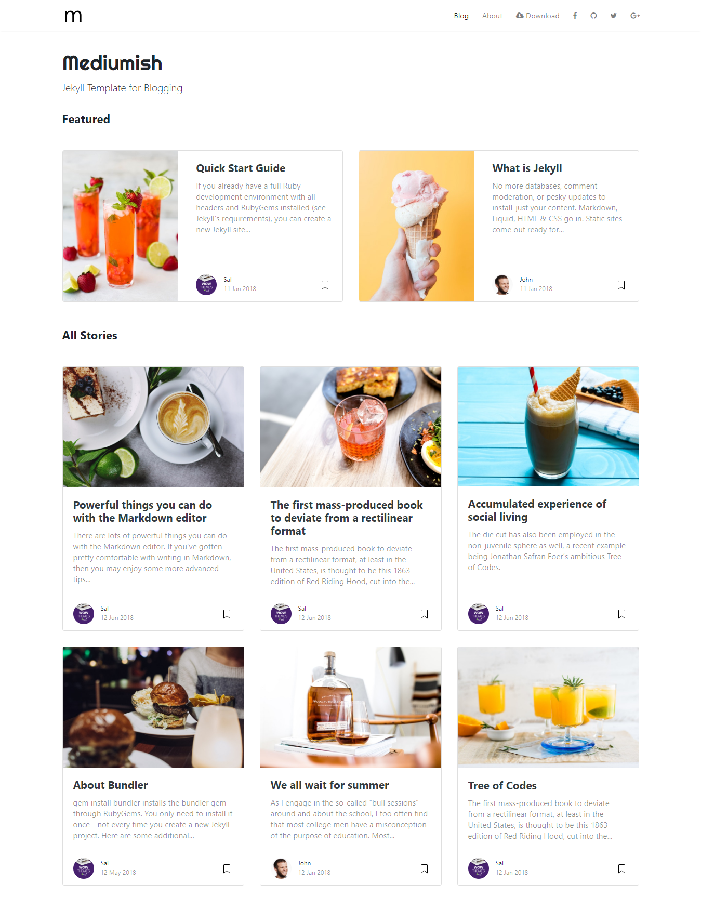

> # ⛔ ARCHIVIO — repository dismesso
>
> **Il dominio `bullismoonline.it` non è più gestito da Ivan Ferrero (constatato il 10 agosto 2026).**
> Il sito raggiungibile a quell'indirizzo è di terzi e **non ha alcun rapporto con questo repository**.
>
> Questo repo resta come archivio dei contenuti scritti fra il 2014 e il 2020 (~65 post). **Non modificarlo, non pubblicarlo, e soprattutto non trattarlo come una superficie viva in bonifiche o audit:** una correzione fatta qui non raggiunge nessun lettore.
>
> Perché il cartello esiste: il 10/08/2026 la bonifica della data d'iscrizione all'Albo ha corretto e committato il footer di questo layout **prima** di accorgersi che il dominio non era più di Ivan. Lavoro perso. Senza un marcatore visibile, la prossima bonifica ci ricasca.
>
> ⚠️ Chi cita questo progetto in una bio o in un media kit deve usare la forma **al passato e senza dominio**: «Ho fondato e diretto dal 2009 un portale divulgativo sulla sicurezza digitale e sul cyberbullismo». Nominare l'indirizzo manda chi verifica su un sito che Ivan non controlla.

---

# Jekyll Template - Mediumish by WowThemes.net

[Live Demo](https://wowthemesnet.github.io/mediumish-theme-jekyll/) &nbsp; | &nbsp; [Download](https://github.com/wowthemesnet/mediumish-theme-jekyll/archive/master.zip) &nbsp; | &nbsp; [Buy me a coffe](https://www.buymeacoffee.com/sal)



### Features

- Built for Jekyll
- Compatible with Github pages
- Featured Posts
- Index Pagination
- Post Share
- Post Categories
- Prev/Next Link
- Category Archives (this is not yet compatible with github pages though)
- Jumbotron Categories
- Integrations:
    - Disqus Comments
    - Google Analaytics
    - Mailchimp Integration
- Design Features:
    - Bootstrap v4.x
    - Font Awesome
    - Masonry
- Layouts:
    - Default
    - Post
    - Page
    - Archive
    
### Using Mediumish

- Open `_config.yml`. If your site is in root, for `baseurl`, make sure this is set to `baseurl: ''`
Also, change your Google Analytics code, disqus username, authors, Mailchimp list etc.
- Mediumish requires 2 plugins: 
    - `$ gem install jekyll-paginate`
    - `$ gem install jekyll-archives`.
- Edit the menu and footer copyrights in `default.html`
- Start by adding your .md files in `_posts`. Mediumish already has a few as an example. 
- YAML front matter
    - featured post - `featured:true`
    - exclude featured post from "All stories" loop to avoid duplicated posts - `hidden:true`
    - post image - `image: assets/images/mypic.jpg`
    - page comments - `comments:true`
    - meta description (optional) - `description: "this is my meta description"`
    
**YAML Post Example**:

```
---
layout: post
title:  "We all wait for summer"
author: john
categories: [ Jekyll, tutorial ]
image: assets/images/5.jpg
featured: true
---
```

`comments: false` - disable comments in posts

`image: "https://www.myexternal.com/image.jpg"`  - set external featured image
    
**YAML Page Example**:

```
---
layout: page
title: Mediumish Template for Jekyll
comments: true
---
```

### Copyright

Copyright (C) 2018 WowThemes.net.

**Mediumish for Jekyll** is designed and developed by [Sal](https://www.wowthemes.net) and it is *free* under MIT license. 

<a href="https://www.buymeacoffee.com/sal" target="_blank"></a>

### Contribute

- [Clone the repo](https://github.com/wowthemesnet/mediumish-theme-jekyll).
- Create a branch off of master and give it a meaningful name (e.g. my-new-mediumish-feature).
- Open a pull request on GitHub and describe the feature or fix.

Thank you so much for your contribution!

-----------------

[Live Demo](https://wowthemesnet.github.io/mediumish-theme-jekyll/) &nbsp; | &nbsp; [Download](https://github.com/wowthemesnet/mediumish-theme-jekyll/archive/master.zip)
